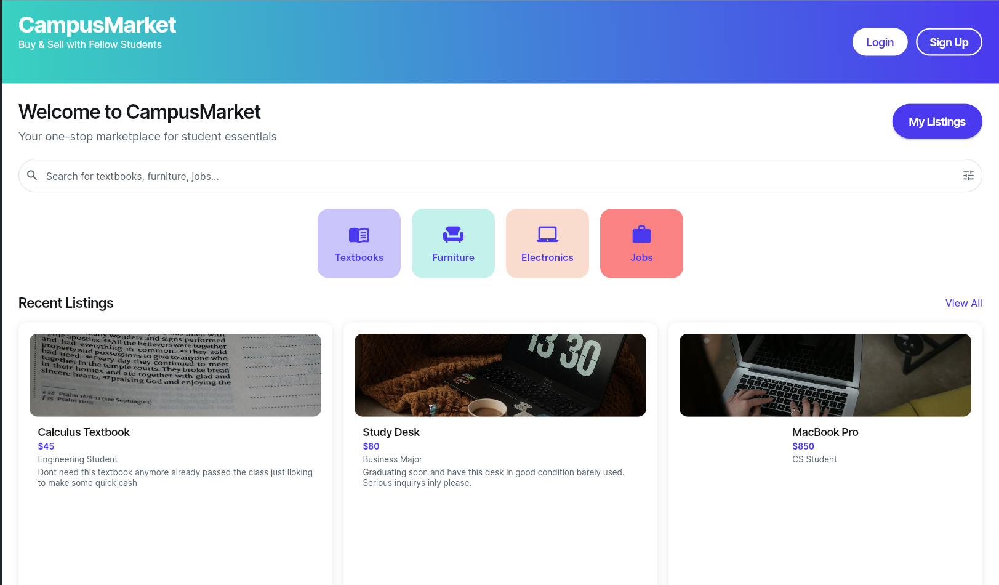
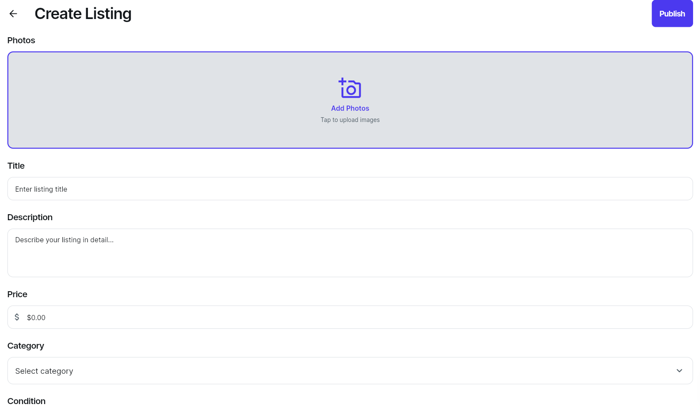
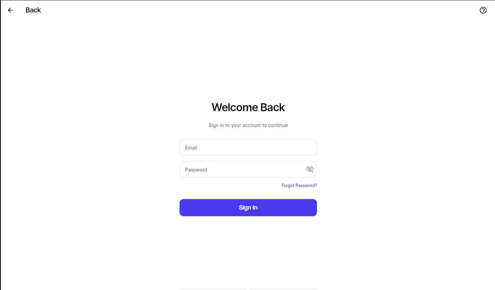
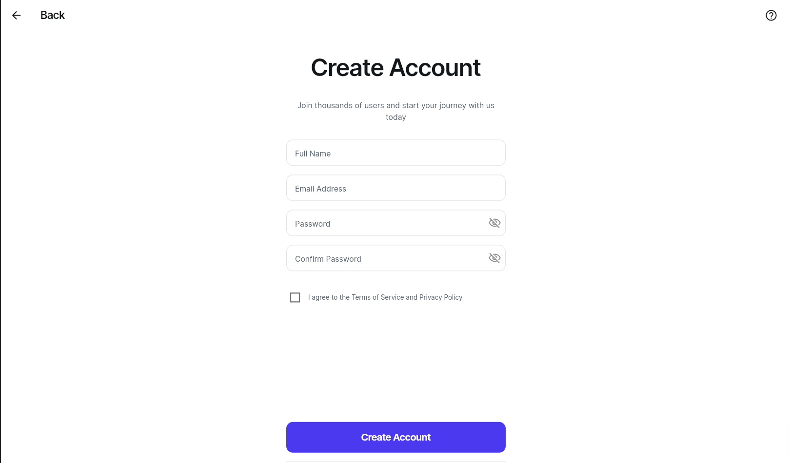
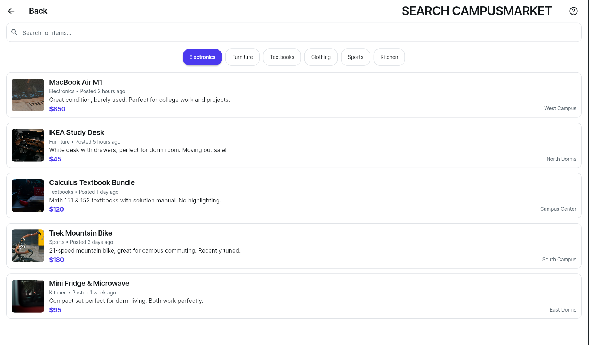
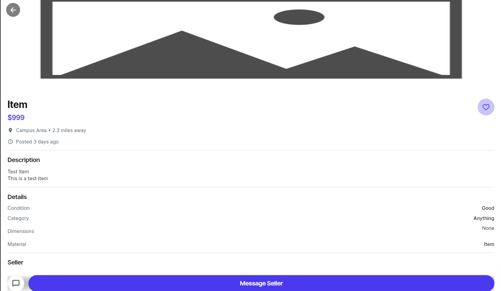

# 🎓 Campus Market

> A trusted student-to-student marketplace built exclusively for university communities.

Built in 36 hours at **Hack@URI** — by a team of 2.

---

## 💡 The Idea

College students constantly need things — cheap textbooks, a tutor before finals, someone to help move furniture, a part-time gig. But existing platforms like Facebook Marketplace or Craigslist have no trust layer. Anyone can show up.

**Campus Market** solves this by restricting access to verified `.edu` email holders only. Every person on the platform is a student at your school — making it safer, more relevant, and more community-driven than any general marketplace.

---

## 📸 Screenshots

| Home / Browse | Create Listing | Login |
|---|---|---|
|  |  |  |

| Create Account | My Listings | Search | View Listing |
|---|---|---|---|
|  |  |  |  |
---

## ✨ Features

- **🔐 University-verified login** — Authentication via Firebase, restricted to `.edu` email addresses
- **📋 Listing creation** — Post items for sale, tutoring sessions, tasks, or jobs
- **🛍️ Browse marketplace** — Scroll and explore what your campus community is offering
- **📱 Web app** — Accessible from any browser, no download required

---

## 🛠️ Tech Stack

| Layer | Technology |
|---|---|
| Frontend | Flutter (via FlutterFlow) |
| Language | Dart |
| Auth & Backend | Firebase |
| Platform | Web App |

---

## 🚀 Getting Started

This project was built using [FlutterFlow](https://flutterflow.io/). To run it locally:

```bash
# Clone the repo
git clone https://github.com/ardenisss/CampusMarket.git
cd campus-market

# Install Flutter dependencies
flutter pub get

# Run the app
flutter run -d chrome
```

> **Note:** You'll need a Firebase project configured with your own `google-services.json` / `GoogleService-Info.plist`. See [Firebase setup docs](https://firebase.google.com/docs/flutter/setup).

---

## 🗺️ What We'd Build Next

Given more time, here's where we'd take Campus Market:

- **✅ `.edu` email enforcement** — Verify university affiliation on signup, restrict access to one school's listings per account
- **💬 In-app messaging** — Direct chat between buyers and sellers without sharing personal contact info
- **⭐ Ratings & reviews** — Build trust with a reputation system tied to your university identity
- **💳 Payment integration** — Secure in-app payments so no money ever has to change hands off-platform
- **🏫 University-specific feeds** — Isolated marketplaces per school so you only see listings from your campus

---

## 👥 Team

Built by a team of 2 at [Hack@URI](https://hackuri.com/).

---
